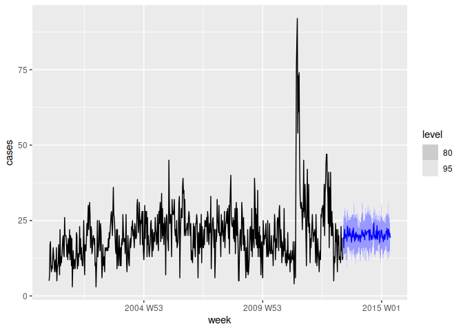

<!-- README.md is generated from README.Rmd. Please edit that file -->

# fable.tscount

<!-- badges: start -->

[](https://www.tidyverse.org/lifecycle/#experimental)
[](https://CRAN.R-project.org/package=fable.tscount)
[](https://codecov.io/gh/mitchelloharawild/fable.tscount?branch=master)
[](https://github.com/mitchelloharawild/fable.tscount/actions)
<!-- badges: end -->

The `{fable.tscount}` package allows `tsglm()` models from the
[`{tscount}`]((https://cran.r-project.org/package=tscount)) package to
be used in a tidy workflow with the modelling interface of ‘fabletools’.
This extends ‘tscount’ to provide enhanced model specification and
management, performance evaluation methods, and model combination tools.

## Installation

You can install the **development** version from
[GitHub](https://github.com/mitchelloharawild/fable.tscount)

``` r
# install.packages("remotes")
remotes::install_github("mitchelloharawild/fable.tscount")
```

<!-- You can install the released version of fable.tscount from [CRAN](https://CRAN.R-project.org) with: -->
<!-- ``` r -->
<!-- install.packages("fable.tscount") -->
<!-- ``` -->

## Usage

``` r
library(fable.tscount)
#> Loading required package: fabletools
library(tsibble)
#> 
#> Attaching package: 'tsibble'
#> The following objects are masked from 'package:base':
#> 
#>     intersect, setdiff, union
ecoli <- tsibble(
  week = yearweek(paste0(tscount::ecoli$year, " W", tscount::ecoli$week)),
  cases = tscount::ecoli$cases,
  index = "week"
) 
ecoli %>% 
  model(TSCOUNT(cases)) %>% 
  forecast(bootstrap = TRUE, times = 10) %>% 
  autoplot(ecoli)
```



## Code of Conduct

Please note that the fable.tscount project is released with a
[Contributor Code of
Conduct](https://contributor-covenant.org/version/2/0/CODE_OF_CONDUCT.html).
By contributing to this project, you agree to abide by its terms.
